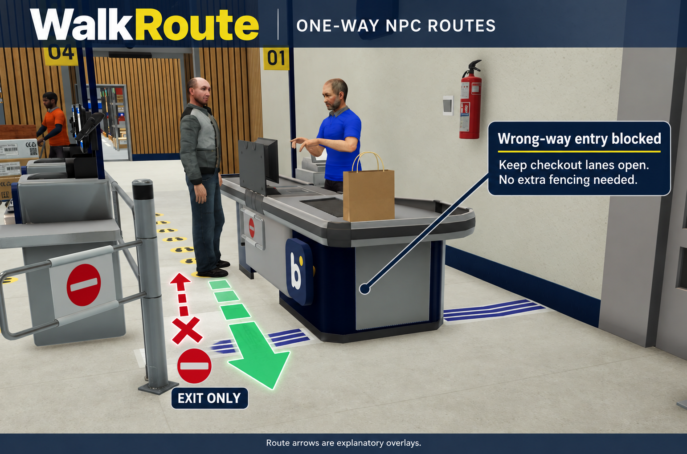

# Walk Route for Megastore Simulator

One-way walking lines for Megastore Simulator. Place a line on the floor and customers can only cross it in the direction of the arrow. Made for checkout lanes, so customers stop walking against the flow past the registers.

It works the same way as the game's own entrance gate, just without the gate, animation and sound. Outside placement mode the lines are invisible (adjustable).



## Requirements

- Tobey's BepInEx Pack for Megastore Simulator (BepInEx 5)
- Optional: BepInEx Configuration Manager, to change the settings in game (F1)

## Installation

Download `WalkRoute-<version>.zip` from the Releases page and extract it into the game folder (the folder with `Megastore Simulator.exe`), so you end up with `BepInEx\plugins\WalkRoute\WalkRoute.dll`.

## Controls

Press **P** in your store to enter placement mode. All routes become visible and a panel shows the keys.

| Key | Action |
|---|---|
| P | Placement mode on/off |
| Scroll | Rotate 15° (Ctrl+scroll 5°, Q/E 90°) |
| Shift+scroll | Width (0.5 to 10 m) |
| Left mouse | Place the route |
| Right mouse on an arrow | Pick up the route (keeps width and direction) |
| Delete on an arrow | Remove the route |

## Tips

- The arrow points in the allowed walking direction.
- Make the line wide enough to reach the wall, checkout or shelf at both ends, otherwise customers simply walk around it.
- Staff (restockers, unloaders, cashiers) use the same navigation, so a one-way line applies to them too. Keep the storage room and all shelves reachable.
- A customer who cannot find a path walks to the nearest reachable point and waits there. If customers stand still in front of an invisible line, a route closes off too much.
- Customers who are already walking pick a new path once their old one becomes invalid. Give it a moment after placing a line.
- Don't place a line between a queue and its checkout: queue positions are fixed.

## Settings

File: `BepInEx\config\eyonator.megastore.walkroute.cfg` (created on first start).

| Setting | Default | Meaning |
|---|---|---|
| `ToggleKey` | P | Placement mode on/off |
| `DeleteKey` | Delete | Remove the route you are looking at |
| `ReloadKey` | None | Rebuild all routes of this save |
| `ClearAllKey` | None | Remove all routes of this save |
| `DefaultWidth` | 2 | Width of a new route (m) |
| `WidthStep` | 0.25 | Width change per scroll tick (m) |
| `LinkWidth` | 0 | Width of the one-way passage; 0 = full route width (the game's entrance gate uses 0.6) |
| `ObstacleDepth` | 0.1 | Thickness of the blocking line (m) |
| `BothWays` | false | Allow crossing both ways (the route is then only a marker) |
| `Alpha` | 0 | Arrow visibility outside placement mode (0 = invisible) |
| `EditAlpha` | 0.85 | Arrow visibility in placement mode |
| `ShowHelp` | true | Show the help panel in placement mode |
| `HelpCorner` | BottomLeft | Screen corner of the help panel |
| `HelpScale` | 1 | Size of the help panel |
| `MaxDistance` | 30 | Maximum placement distance (m) |

Custom arrow: put your own `arrow.png` in `BepInEx\config\WalkRoute\`. It is stretched across the route width; an arrow pointing up is the walking direction.

## Saving

Routes are stored per save slot in `BepInEx\config\WalkRoute\WalkRoute_Profile_<slot>.json`, not in the game's save file, and are restored two seconds after the store has loaded. Starting a new game in a slot that already had routes? Delete that slot's file first (or set a `ClearAllKey`).

## Uninstall

Delete the folder `BepInEx\plugins\WalkRoute`. The mod writes nothing into the game's save, so your save keeps working. Optionally also delete `BepInEx\config\WalkRoute` and the cfg file.

## How it works

Customers and staff walk on the game's baked navigation mesh. Each route adds two things where you place it:

- a carving `NavMeshObstacle` across the full width of the line, which cuts the walkable area in two;
- a one-way link (`NavMesh.AddLink` with `bidirectional = false`) through the line, from 0.35 m in front of it to 0.35 m behind it, which is the only connection between both sides.

The game's own entrance gate uses the same combination; the gate itself only animates. The mod uses no Harmony patches. The key help panel is a clone of the game's notification panel, so it uses the game's font and background.

## Building

Requirements: the .NET SDK and the game with Tobey's BepInEx Pack installed (the project compiles against the game's assemblies and BepInEx).

```
dotnet build -c Release
```

The project expects the game in `C:\Program Files (x86)\Steam\steamapps\common\Megastore Simulator`. For another location:

```
dotnet build -c Release -p:GameDir="D:\Games\Megastore Simulator"
```

After a successful build, `WalkRoute.dll` is copied to `BepInEx\plugins\WalkRoute` in the game folder.

## Changelog

- 1.0.1: Code comments in English and a banner in the README. No changes in how the mod works.
- 1.0.0: First release.

## License

MIT License, Copyright (c) 2026 Eyonator. See [LICENSE](LICENSE).
